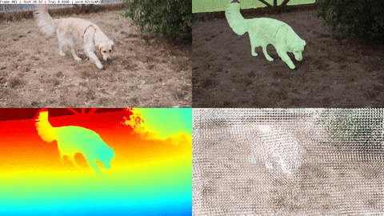
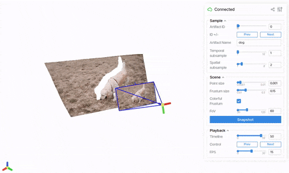

# ViPE: Video Pose Engine for Geometric 3D Perception

<p align="center">
  
</p>

**TL;DR: ViPE is a useful open-source spatial AI tool for annotating camera poses and dense depth maps from raw videos!**

**Contributors**: NVIDIA (Spatial Intelligence Lab, Dynamic Vision Lab, NVIDIA Issac, NVIDIA Research).

**Full Abstract**: Accurate 3D geometric perception is an important prerequisite for a wide range of spatial AI systems. While state-of-the-art methods depend on large-scale training data, acquiring consistent and precise 3D annotations from in-the-wild videos remains a key challenge. In this work, we introduce ViPE, a handy and versatile video processing engine designed to bridge this gap. ViPE efficiently estimates camera intrinsics, camera motion, and dense, near-metric depth maps from unconstrained raw videos. It is robust to diverse scenarios, including dynamic selfie videos, cinematic shots, or dashcams, and supports various camera models such as pinhole, wide-angle, and 360° panoramas. 
We use ViPE to annotate a large-scale collection of videos. This collection includes around 100K real-world internet videos, 1M high-quality AI-generated videos, and 2K panoramic videos, totaling approximately 96M frames -- all annotated with accurate camera poses and dense depth maps. We open source ViPE and the annotated dataset with the hope to accelerate the development of spatial AI systems.

**[Technical Whitepaper](https://research.nvidia.com/labs/toronto-ai/vipe/assets/paper.pdf), [Project Page](https://research.nvidia.com/labs/toronto-ai/vipe), [Dataset](https://huggingface.co/) (Coming Soon)**

## Installation

To ensure the reproducibility, we recommend creating the runtime environment using [conda](https://docs.conda.io/projects/conda/en/latest/user-guide/getting-started.html).

```bash
# Create a new conda environment and install 3rd-party dependencies
conda env create -f envs/base.yml
conda activate vipe
pip install -r envs/requirements.txt

# Build the project and install it into the current environment
# Omit the -e flag to install the project as a regular package
pip install --no-build-isolation -e .
```

## Usage

### Using the ViPE CLI

Once the python package is installed, you can use the `vipe` CLI to process raw videos in mp4 format.

```bash
# Replace YOUR_VIDEO.mp4 with the path to your video. We provide sample videos in assets/examples.
vipe infer YOUR_VIDEO.mp4
# Additional options:
#   --output: Output directory (default: vipe_results)
#   --visualize: Enable visualization of intermediate and final results (default: false)
#   --pipeline: Pipeline configuration to use (default: default)
```



One can visualize the results that ViPE produces by running (supported by `viser`):
```bash
vipe visualize vipe_results/
# Please modify the above vipe_results/ path to the output directory of your choice.
```



> We found that running [video-depth-anything](https://github.com/DepthAnything/Video-Depth-Anything) might eat up too much of GPU memory. To that end we provide a `no_vda` config that produces less temporally-stable depth (but empirically more 3D consistent) maps. This can be triggered by adding `--pipeline no_vda` to the `vipe infer` command.

### Using the `run.py` script

The `run.py` script is a more flexible way to run ViPE. Compared to the CLI, the script supports running on multiple videos at once and allows more fine-grained control over the pipeline with `hydra` configs. It also provides an example of using `vipe` as a library in your own project.

Example usages:

```bash
# Running the full pipeline.
python run.py pipeline=default streams=raw_mp4_stream streams.base_path=YOUR_VIDEO_OR_DIR_PATH

# Running the pose-only pipeline without depth estimation.
python run.py pipeline=default streams=raw_mp4_stream streams.base_path=YOUR_VIDEO_OR_DIR_PATH pipeline.post.depth_align_model=null
```


## Acknowledgments

ViPE is built on top of many great open-source research projects and codebases. Some of these include (not exhaustive):
- [DROID-SLAM](https://github.com/princeton-vl/DROID-SLAM)
- [Depth Anything V2](https://github.com/DepthAnything/Depth-Anything-V2)
- [Metric3Dv2](https://github.com/YvanYin/Metric3D)
- [PriorDA](https://github.com/SpatialVision/Prior-Depth-Anything)
- [UniDepth](https://github.com/lpiccinelli-eth/UniDepth)
- [VideoDepthAnything](https://github.com/DepthAnything/Video-Depth-Anything)
- [GeoCalib](https://github.com/cvg/GeoCalib)
- [Segment and Track Anything](https://github.com/z-x-yang/Segment-and-Track-Anything)

Please refer to the [THIRD_PARTY_LICENSES.md](THIRD_PARTY_LICENSES.md) for a full list of projects and their licenses.

We thank useful discussions from Aigul Dzhumamuratova, Viktor Kuznetsov, Soha Pouya, and Ming-Yu Liu, as well as release support from Vishal Kulkarni.

## TODO

- [x] Initial code released under Apache 2.0 license.
- [ ] Full dataset uploaded to Hugging Face for download.
- [ ] Add instructions to run inference on wide-angle and 360° videos.
- [ ] Add instructions for benchmarking.

## Citation

If you find ViPE useful in your research or application, please consider citing the following whitepaper:

```
@inproceedings{huang2025vipe,
    title={ViPE: Video Pose Engine for 3D Geometric Perception},
    author={Huang, Jiahui and Zhou, Qunjie and Rabeti, Hesam and Korovko, Aleksandr and Ling, Huan and Ren, Xuanchi and Shen, Tianchang and Gao, Jun and Slepichev, Dmitry and Lin, Chen-Hsuan and Ren, Jiawei and Xie, Kevin and Biswas, Joydeep and Leal-Taixe, Laura and Fidler, Sanja},
    booktitle={NVIDIA Research Whitepapers},
    year={2025}
}
```

## License

This project will download and install additional third-party **models and softwares**. Note that these models or softwares are not distributed by NVIDIA. Review the license terms of these models and projects before use. This source code is released under the [Apache 2 License](https://www.apache.org/licenses/LICENSE-2.0).
